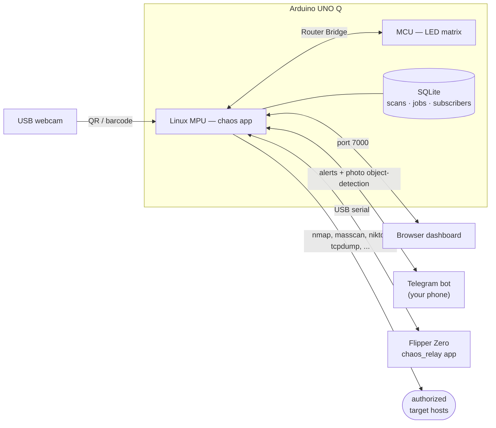

# 🌀 chaos

**The brain half of a two-device pentest platform.** Point a camera at
something, run a full recon/exploitation pass, and hand the result to a
Flipper Zero over the same USB cable — all from a $44 Linux+MCU board that
also happens to already have nmap, nikto, gobuster, sqlmap, and hydra sitting
on it.

Most Flipper Zero projects stop at "custom firmware with a nicer menu."
Nothing else pairs a Flipper-class handheld with a real vision-and-LLM
companion that can look at a device, run a full pentest pass against it, and
push the result back to a screen in your hand — because nothing else has
needed to build that bridge. `chaos` builds it: this repo is the AI/vision
side, running on an **Arduino UNO Q**,
[`flipper-apps`](https://github.com/Breaux-cpu/flipper-apps) is the
on-device display side, and the two talk to each other over plain USB
serial today, verified working, not a roadmap slide.

It's a QR/barcode scanner (`camera_code_detection` Brick), an authorized-use
pentest toolkit wrapping eleven security tools already on the board, a live
status mirror on the MCU's LED matrix (scanning / match / alert), a web
dashboard on port 7000, a Telegram bot that pushes every scan and job result
to your phone (and runs object detection on photos you send it), and a
USB-serial bridge that mirrors the same status onto a connected Flipper's
screen.

**Authorized use only.** This app can trigger real network scans, credential
brute-forcing, and traffic capture against real hosts. Only point it at
systems you own or are explicitly authorized to test. See
[CONTRIBUTING.md](CONTRIBUTING.md) for what that means for contributions.

## How it fits together



Two devices, one cable: the Arduino UNO Q does the vision, storage, and
network work, and mirrors status to the Flipper over USB serial. The web
dashboard and the Telegram bot are two independent ways to drive it and read
results — the bot needs nothing but your phone, wherever you are.

## Pentest toolkit

`python/pentest.py` is a standalone module (no dependency on the Arduino app
framework) wrapping eleven tools that ship on this board:

| Tool | Use | Notes |
|---|---|---|
| `nmap` | Host discovery / port / service scanning | Profiles: discovery, quick, version, full |
| `masscan` | Fast SYN port scan for large ranges | Trades nmap's service/version ID for raw speed; needs the same capability grant as tcpdump below |
| `whois` | Domain/IP registration lookup | Informational only — queries a public registry, never touches the target itself |
| `nikto` | Web server vulnerability scan | Target must be a URL |
| `gobuster` | Directory/file enumeration | Uses `python/wordlists/common-paths.txt` |
| `sqlmap` | SQL injection testing | `--batch --level=1 --risk=1` — low-noise defaults |
| `hydra` | Credential brute-forcing | ssh/ftp/http-get only, `python/wordlists/{users,passwords}.txt`, stops at first hit |
| `tcpdump` | Packet capture to a .pcap file | Writes to `captures/*.pcap`, capped at 120s |
| `tshark` | Packet capture with readable output | Same filters/duration cap as tcpdump, but decodes packets to one-line summaries directly in the job output instead of an opaque file |
| `wifi_scan` | Passive WiFi recon (aircrack-ng suite) | Enables monitor mode, records nearby APs/clients, restores managed mode. **Interrupts WiFi on that interface for the scan's duration** — if you're connected to this board over the same WiFi link, expect to get dropped until it finishes. |
| `wifi_deauth` | Deauth an AP's client(s) | Needs an interface already in monitor mode (run `wifi_scan` or `airmon-ng start` by hand first). BSSID and client MAC are validated as strict `AA:BB:CC:DD:EE:FF` — blank client MAC deauths everyone on that AP. |

Every target is validated against a strict allow-pattern before it's placed
in a subprocess argv list — commands never go through a shell, so there's no
injection surface. There is **no allowlist of permitted hosts**; scope
enforcement is on you, the operator.

**`tcpdump`, `masscan`, and the WiFi tools need a one-time capability
grant** — the app runs as an unprivileged user, so captures/raw sockets/
monitor-mode fail with a permission error until you run:

```bash
sudo setcap cap_net_raw,cap_net_admin=eip /usr/bin/tcpdump
sudo setcap cap_net_raw,cap_net_admin=eip /usr/bin/masscan
sudo setcap cap_net_raw,cap_net_admin=eip /usr/sbin/airmon-ng
sudo setcap cap_net_raw,cap_net_admin=eip /usr/sbin/airodump-ng
sudo setcap cap_net_raw,cap_net_admin=eip /usr/sbin/aireplay-ng
```

`tshark` needs the same grant if it's a separate binary from `tcpdump` on
your install (it usually is): `sudo setcap cap_net_raw,cap_net_admin=eip
$(which tshark)`. `whois` needs no special privileges — it's a plain TCP
client to a public WHOIS server, same as any other outbound connection.

The aircrack-ng grants are **unverified** — `airmon-ng` shells out to `iw`/
`ip` internally to reconfigure the interface, and whether its own
capabilities propagate to those child processes depends on the kernel/driver
combination. If a `wifi_scan` job errors out with a permission problem even
after the `setcap` calls above, that's the likely cause — file an issue with
the exact error, it's a known open question, not a mystery to debug from
scratch.

**The dashboard has no authentication by default.** Anyone who can reach
`http://<board-ip>:7000` can trigger scans — including `wifi_deauth`, an
active attack against real clients, not just passive recon. Set
`CHAOS_PENTEST_TOKEN` in Brick Configuration to require a shared token on
every pentest action; enter the same value in the "Auth token" field on the
dashboard (stored in that browser's `localStorage` so it doesn't need
retyping every visit — only as safe as the device it's typed into). Given
what this toolkit can do, **set this token** rather than relying on network
placement alone. Port 7000 is firewalled to `tailscale0` at the network
level on the reference Arduino UNO Q deployment — check your own host's
firewall if you're running this elsewhere, but treat that as defense in
depth, not a substitute for the token.

## Flipper Zero bridge

`python/flipper_bridge.py` pushes a one-line status update to a connected
Flipper Zero running the companion
[`chaos_relay`](https://github.com/Breaux-cpu/flipper-apps) app, over the
same USB cable — no BLE, no pairing. Fires automatically on every QR/barcode
scan and every pentest job completion/failure. Best-effort: a missing or
busy Flipper never blocks chaos itself. Requires `pyserial`
(`python/requirements.txt`) and `/dev/flipper` (or another stable path to
the device) to be reachable from wherever chaos actually runs.

## Telegram alerts

Every scan hit and every pentest job result can be pushed straight to your
phone via a Telegram bot (`telegram_bot` Brick) — the one alert channel that
works from anywhere, no camera or Flipper in front of you required.

It's **off unless you configure it.** Set `TELEGRAM_BOT_TOKEN` (from
[@BotFather](https://t.me/botfather)) in Brick Configuration to turn it on;
with no token, chaos runs exactly as before and the bot never starts.

Telegram won't let a bot message someone who hasn't messaged it first, so
send the bot `/start` once to subscribe — after that you get every scan and
job result automatically. Commands: `/start`, `/stop`, `/status`, `/scans`,
`/jobs`, `/help`. Subscribers are stored in the same SQLite DB, so they
survive a restart.

**Send the bot a photo** and it runs object detection on it (`object_detection`
Brick, COCO classes — laptop, phone, keyboard, TV, and the rest), replying
with the annotated image and a labelled, confidence-ranked summary. It's a
device-ID path that doesn't need the board's own camera: point your phone at
the thing, send the picture, get back what's in it.

**Lock down who can subscribe.** Anyone who finds an unrestricted bot can
`/start` it and read your scan/job data. Set `CHAOS_TELEGRAM_USER_IDS` (a
comma-separated list of Telegram user IDs — get yours from
[@userinfobot](https://t.me/userinfobot)) to whitelist only yourself. The bot
logs a warning at startup if the token is set but the whitelist isn't.

## Persistent history

Every scan and every completed/errored pentest job is written to a local
SQLite database (`dbstorage_sqlstore` Brick) as well as kept in memory. The
dashboard seeds its scan/job lists from that saved history the moment you
open it — including entries from before the last restart — so you don't start
at an empty screen. **Reload from history** re-syncs the lists from disk on
demand, and `/api/history/scans` / `/api/history/jobs` expose the same data
as plain REST endpoints outside the dashboard.

## Run it

```bash
arduino-app-cli app start ~/ArduinoApps/chaos
arduino-app-cli app logs ~/ArduinoApps/chaos --follow
```

Then open `http://<board-ip>:7000` for the dashboard, or `arduino-app-cli monitor`
for MCU-side serial output. QR/barcode scanning requires a USB webcam.

## What's next

- On-board (camera-fed) object detection for live device ID, complementing
  the Telegram photo path that already does it on demand
- Marauder integration on the Flipper's WiFi Devboard (ESP32) as an
  alternative to `wifi_scan`/`wifi_deauth` that doesn't interrupt this
  board's own WiFi connection

## Contributing

See [CONTRIBUTING.md](CONTRIBUTING.md) — including a straightforward path
to adding a new pentest tool wrapper. Please read
[CODE_OF_CONDUCT.md](CODE_OF_CONDUCT.md) too.

## Support this project

This is a solo build, in the open, as it happens — the commit history is the
real build log. If you want to back it:

- **⭐ Star the repo.** Sounds small; it's the #1 thing that gets a project
  in front of the next contributor, since it's most of what GitHub's
  discovery surfaces run on.
- **Try it and open issues.** A precise bug report or a "here's where I got
  stuck" from a real run is worth more than a compliment.
- **Send a PR.** [CONTRIBUTING.md](CONTRIBUTING.md) has a scoped first task
  (add a new pentest tool wrapper) that doesn't require reading the whole
  codebase first.
- **[💜 Sponsor on GitHub](https://github.com/sponsors/Breaux-cpu)** — funds
  the actual hardware this project depends on (a Flipper Zero, USB
  peripherals, eventually a second board for Track A). If that link 404s,
  GitHub Sponsors isn't enabled on the account yet — starring/sharing still
  helps just as much in the meantime.
- **Share it** with anyone who'd find the Arduino UNO Q ↔ Flipper bridge
  idea interesting — that's the piece nobody else has built yet.

## License

[MIT](LICENSE)
